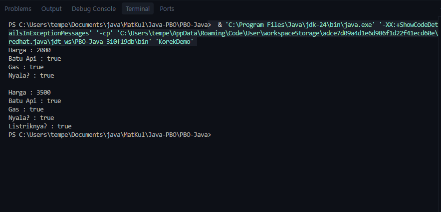
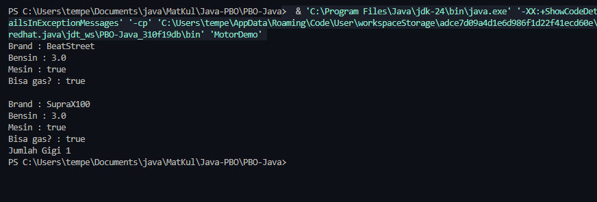

<h1 align = "center">Jobsheet 1 - PBO </h1>

```
Nama        :Lindhu Nuril Rahmatdanto
NIM         :254107020216
Kelas       :TI 2G  
```
## Pertanyaan
1.Jelaskan perbedaan antara object dengan class!
Object adalah benda / program yang memiliki state dan behaviour yang di ciri khaskan pada benda / program tersebut.Sedangkan class adalah bentuk blueprint dari suatu object

2.Jelaskan alasan gear dan brand dapat menjadi atribut dari object bike
karena gear dan brand adalah atribut yang melekat pada object sepeda

3.Sebutkan salah satu kelebihan utama dari pemrograman berorientasi objek dibandingkan dengan pemrograman prosedural!
karena dengan pemrograman berorientasi pada objek,developer bisa dengan mudah membuat class dari object yang sudah ada tanpa harus repot repot membuat class dan atribut di dalamnya

4.Apakah diperbolehkan melakukan pendefinisan dua buah atribut dalam satu baris kode seperti public String nama, alamat; ?
diperbolehkan karena kedua atribut tersebut type datanya adalah string

5.Pada class RoadBike ,jelaskan alasan atribut brand, speed dan gear tidak lagi ditulis dalam class tersebut
karena ada syntaks extend pada class roadbike yang memungkinkan class roadbike mendapatkan inheritance dari class yang di extend ( dalam hal ini class bike )

## Praktikum
Object pertama : 

Hasil Demo :


Object Kedua :

Hasil Demo:
