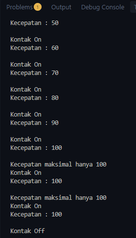
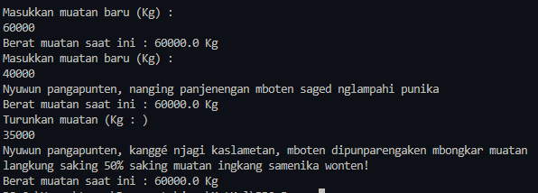
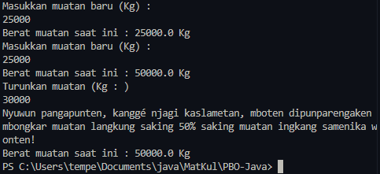
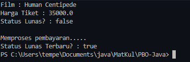

<h1 align = "center">Jobsheet 3 - PBO </h1>

```
Nama        :Lindhu Nuril Rahmatdanto
NIM         :254107020216
Kelas       :TI 2G  
```
## 3.3 Pertanyaan 
1. Pada class testMobil,saat kita menambah kecepatan untuk pertama kalinya,mengapa muncul peringatan"Kecepatan tidak bisa bertambah karena Mesin Off"
Karena programnya menyatakan bahwa syarat utama menjalankan fungsi tambahKecepatan adalah aktifnya mensin / nyalaMesin dalam keadaan true

2. Mengapa atribut kecepatan dan kontakOn diset private
Agar tidak bisa diakses dari class lain,sehingga nilainya tidak bisa diubah sembarangan

3. Ubah class Motor sehingga kecepatan maksimalnya adalah 100!

```
package Jobsheet3.MotorEncapsulation;

public class Motor {
    private int kecepatan = 0;
    private boolean kontakOn = false;
    private boolean btsKecepatan = false;

    public void nyalakanMesin(){
        kontakOn = true;
    }
    public void matikanMesin(){
        kontakOn = false;
        kecepatan = 0;
    }
    public void tambahKecepatan(){
        if (kontakOn == true && batasKecepatan() == true) {
            kecepatan += 10;
        }else if (kontakOn == true && batasKecepatan() == false) {
            System.out.println("Kecepatan maksimal hanya 100");
        }else{
            System.out.println("Kecepatan tidak bisa bertambah karena Mesin Off");
        }
    }

    public boolean batasKecepatan(){
        if (kecepatan == 100) {
            btsKecepatan = false;
        }else{
            btsKecepatan = true;
        }
        return  btsKecepatan;
    }
    public void kurangiKecepatan(){
        if (kontakOn == true) {
            kecepatan -= 5;
        }else {
            System.out.println("Kecepatan tidak bisa berkurang karena Mesin Off \n" );
        }
    }
    public void printStatus(){
        if (kontakOn == true) {
            System.out.println("Kontak On");
        }else {
            System.out.println("Kontak Off");
        }
        System.out.println("Kecepatan : " + kecepatan + "\n");
    }
}

```



## 3.6 Pertanyaan 
1. Apa yang dimaksud getter dan setter? 
Getter sendiri adalah public method yang memiliki tipe data return sedangkan setter tidak memiliki tipe data return tapi berfungsi sebagai manipulator nilai dari atribut private
2. Apa kegunaan dari method getSimpanan()? 
Untuk mendisplay simpanan anggota dalam variabel money
3. Method apa yang digunakan untuk menambah saldo? 
Method yang digunakan untuk menambah saldo adalah method setor
4. Apa yang dimaksud konstruktor? 
Constructor adalah blok kode special yang digunakan untuk menginisialisasi object yang baru dibuat
5. Sebutkan aturan dalam membuat konstruktor?
- Nama constructor harus sama dengan nama class
- Constructor tidak memiliki tipe data return
- Constructor tidak boleh menggunakan modifier abstract,static,final dan synchronized
6. Apakah boleh konstruktor bertipe private? 
Boleh,ada private constructor yang ditujukan untuk menutup total akses instansiasi yang berasal dari luar kelas
7. Kapan menggunakan konstruktor dengan passing parameter?
Apabila suatu object yang dibuat butuh penamaan awal.Juga keunggulan dari passing parameter adalah tidak perlu memasukkan nilai via pemanggilan method.
8. Apa perbedaan inisialisasi atribut dan instansiasi atribut? 
Inisialisasi adalah proses penamaan dan pemberian value pada suatu variabel sedangkan instansiasi adalah proses pembuatan object pada suatu class
9. Apa perbedaan inisialisasi method dan instansiasi method? 
Inisialisasi method adalah membuat cara kerja / behaviour suatu method sedangkan instansiasi adalah cara memanggil suatu method untuk bekerja

## 5 Tugas

2. Pada program diatas, pada class EncapTest kita mengeset age dengan nilai 35, namun pada saat ditampilkan ke layar nilainya 30, jelaskan mengapa. 
Karena di method setAge() tertera bahwa apabila newAge memiliki value lebih dari 30 (yang mana pada kasus ini adalah 35 dan statusnya otomatis menjadi true)maka age yang di set adalah 30

3. Ubah program diatas agar atribut age dapat diberi nilai maksimal 30 dan minimal 18. 
```
package Jobsheet3.Encap;

public class EncapDemo {
    private String name;
    private int age;

    public String getName(){
        return name;
    }

    public void setName (String newName){
        name = newName;
    }

    public int getAge(){
        return age;
    }

    public void setAge(int newAge){
        if (newAge > 18 && newAge < 30) {
            age = newAge;
        }else{
            age = 0;
        }
    }

}
```
4. Pada sebuah sistem manajemen pergudangan kargo ekspedisi, terdapat class Kontainer yang
memiliki atribut antara lain nomorResi, namaPemilik, kapasitasMaksimal (dalam kg), dan
beratMuatanSaatIni. Kontainer dapat menerima tambahan muatan barang dengan batasan
kapasitas maksimal yang telah ditentukan. Kontainer juga dapat diturunkan muatannya
(bongkar muat). Ketika barang diturunkan, maka jumlah muatan saat ini akan berkurang
sesuai dengan nominal berat yang dikeluarkan.



5. Modifikasi soal kargo logistik di atas agar nominal berat muatan yang dibongkar/diturunkan
dalam satu kali pemanggilan method turunkanMuatan() maksimal hanya boleh sebesar 50%
dari total berat muatan saat ini. Langkah ini diterapkan demi alasan keselamatan kerja
operasional alat berat (crane). Jika operator mencoba menurunkan muatan melebihi batas
50% tersebut, sistem harus memblokir aksi dan memunculkan peringatan: "Maaf, demi
keselamatan, pembongkaran muatan satu kali jalan tidak boleh melebihi 50% dari muatan
saat ini!".



6. Modifikasi kelas Main TestLogistik agar parameter jumlah berat barang yang dimasukkan
(tambahMuatan) maupun berat barang yang dibongkar (turunkanMuatan) dapat menerima
input nilai dinamis dari pengguna secara interaktif melalui terminal menggunakan utilitas
java.util.Scanner.
```
package Jobsheet3.Container;

import java.util.Scanner;

public class ContainerDemo {
    public static void main(String[] args) {
        Container containerAlfa = new Container("Miau", "PT.Doksli", 50000);
        Scanner sc = new Scanner(System.in);

        System.out.println("Nama Pemilik Kontainer : " + containerAlfa.getNama());
        System.out.println("Kapasitas Maksimal : " + containerAlfa.getKapasitasMax() + " Kg");

        System.out.println();

       System.out.println("Masukkan muatan baru (Kg) : ");
       double muatan = sc.nextDouble();

       containerAlfa.tambahMuatan(muatan);
       System.out.println("Berat muatan saat ini : " + containerAlfa.checkMuatan() + " Kg");
       
       System.out.println("Masukkan muatan baru (Kg) : ");
       muatan = sc.nextDouble();

       containerAlfa.tambahMuatan(muatan);
       System.out.println("Berat muatan saat ini : " + containerAlfa.checkMuatan() + " Kg");

       System.out.println("Turunkan muatan (Kg : )");
       muatan = sc.nextDouble();

       containerAlfa.turunkanMuatan(muatan);
       System.out.println("Berat muatan saat ini : " + containerAlfa.checkMuatan() + " Kg");
    }
}

```
7. Sebuah aplikasi pemesanan tiket bioskop memerlukan kelas Tiket untuk mengelola data
pemesanan secara aman. Kelas ini harus memiliki atribut private: judulFilm (String),
hargaDasar (double), dan statusPembayaran (boolean).
Ketentuan pengesetan nilai objek:
● Konstruktor harus menerima parameter judulFilm dan hargaDasar. Nilai awal
statusPembayaran selalu diset false (Belum Dibayar).
● Atribut hargaDasar tidak boleh bernilai negatif. Jika input yang dimasukkan kurang dari 0,
otomatis set nilai default ke Rp 35.000.
● Sediakan method lakukanPembayaran() untuk mengubah statusPembayaran menjadi
true.
● Nilai statusPembayaran hanya boleh dibaca (Read-Only) menggunakan getter, tidak boleh
memiliki fungsi setter langsung dari luar kelas demi alasan keamanan transaksi.
● Uji kode Anda menggunakan kelas TestBioskop berikut:

```
package Jobsheet3.Bioskop;

public class PeliculaDemo {
    public static void main(String[] args) {
        Pelicula p1 = new Pelicula("Human Centipede", -2);
        System.out.println("Film : " + p1.getJudulFilm());
        System.out.println("Harga Tiket : " + p1.getHargaDasar());
        System.out.println("Status Lunas? : " + p1.isStatusPembayaran());

        System.out.println();
        System.out.println("Memproses pembayaran.....");
        p1.lakukanPembayaran();
        System.out.println("Status Lunas Terbaru? : " + p1.isStatusPembayaran());
    }
}

```


